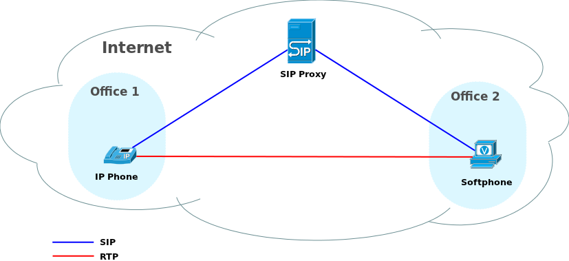
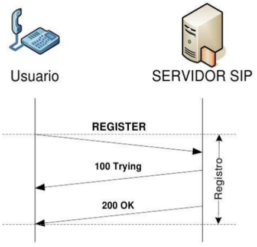
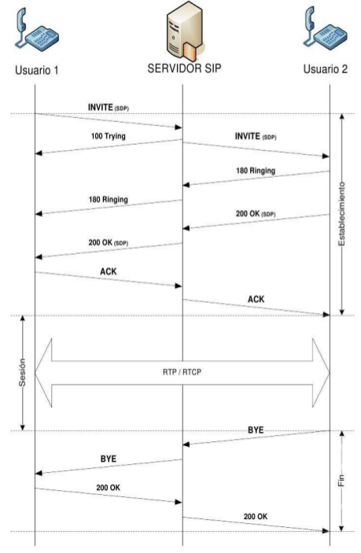
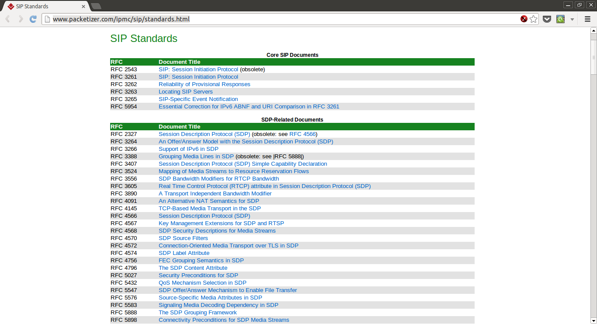
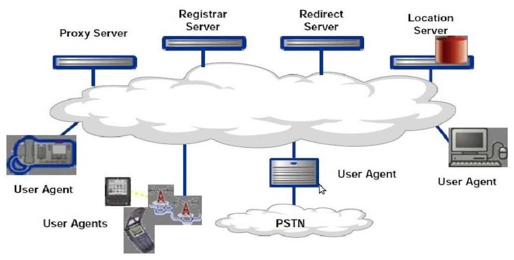
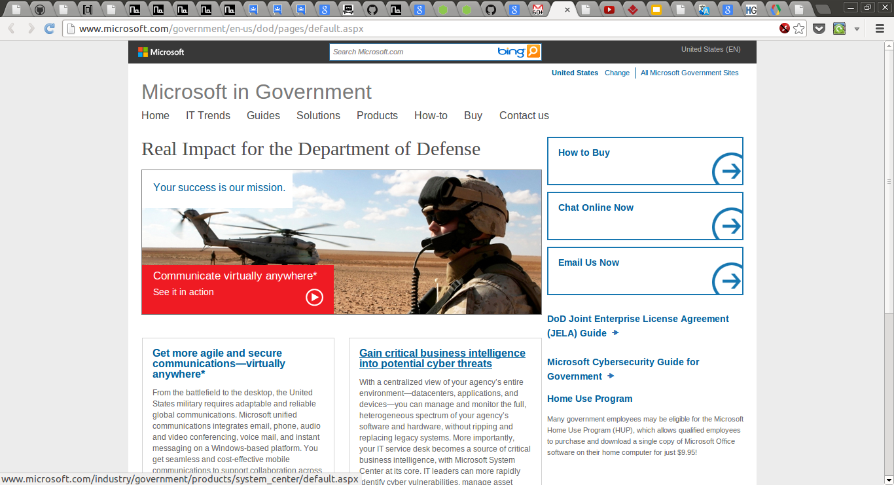
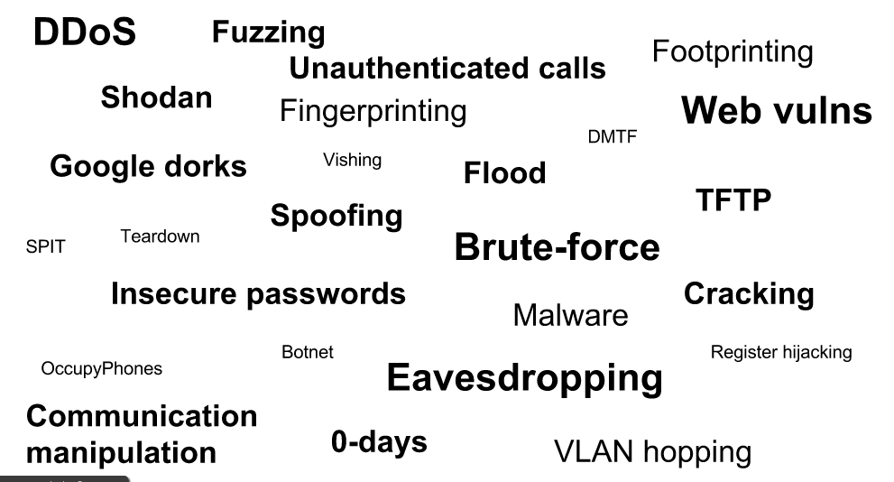
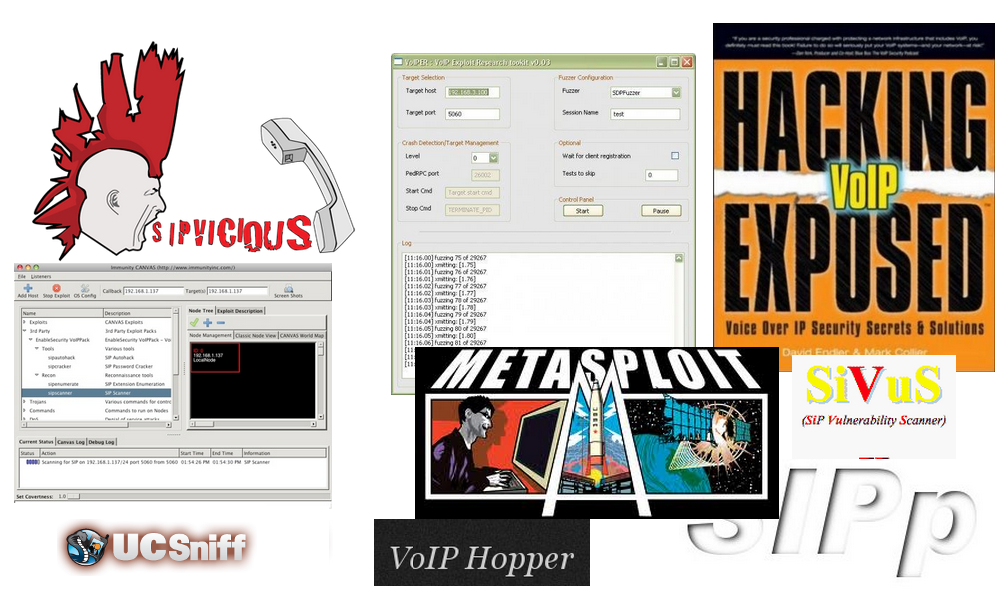
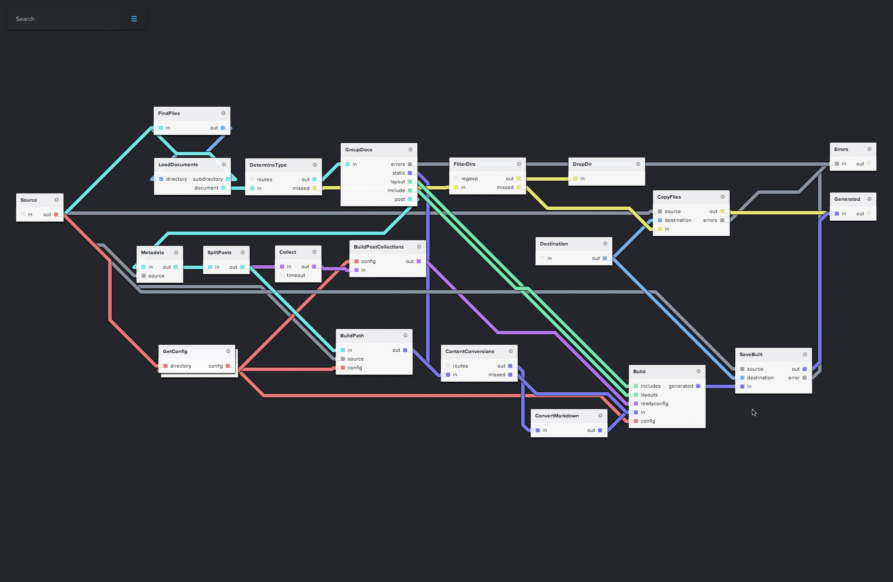

.. Remove style for logo.

.. raw:: html

	

About
-----

Jesús Pérez Rubio
*****************

+ FIC 

+ VoIP developer/Security Engineer (Quobis - Vigo) (Past)

+ Front-end developer (Freelance - USA)

Damián Franco Álvarez
*********************

+ ETSE

+ VoIP developer / Front-end developer (Quobis - Vigo)

Contents
--------

- VoIP

- SIP k ase!

- Funny scenarios

- VoIP security

- Bluebox-ng

- Bluebox-ng 2.0

VoIP
----

VoIP - Intro
------------

- VoIP = Voice over IP

- UC = Unified Communications

- Main protocols

	

VoIP - SIP
----------

Signaling
*********

+ User location

+ User availability

+ Session establishment

+ Session management

VoIP - SIP Requests
-------------------

+ REGISTER

+ INVITE

+ MESSAGE

+ CANCEL

+ ACK

+ BYE

VoIP - SIP Responses
--------------------

- 180 Ringing

- 200 OK

- 401 Unauthorized

- 404 Not found

- 486 Busy here

VoIP - SIP Registering flow
---------------------------

VoIP - SIP Call flow
--------------------

VoIP - Systems
--------------

VoIP - RFCs
-----------

http://www.packetizer.com/ipmc/sip/standards.html

SIP k ase! - SIP Entities
-------------------------

SIP k ase! - IMS
----------------

Funny scenarios - Prison
------------------------

.. raw:: html

	<object width="420" height="315"><param name="movie" value="http://www.youtube.com/v/ar2Oq2ENsrU?hl=es_ES&amp;version=3&amp;rel=0"></param><param name="allowFullScreen" value="true"></param><param name="allowscriptaccess" value="always"></param><embed src="http://www.youtube.com/v/ar2Oq2ENsrU?hl=es_ES&amp;version=3&amp;rel=0" type="application/x-shockwave-flash" width="420" height="315" allowscriptaccess="always" allowfullscreen="true"></embed></object>

Funny scenarios - NASA
----------------------

.. raw:: html

	<object width="420" height="315"><param name="movie" value="http://www.youtube.com/v/N0uYM8L32J4?version=3&amp;hl=es_ES&amp;rel=0"></param><param name="allowFullScreen" value="true"></param><param name="allowscriptaccess" value="always"></param><embed src="http://www.youtube.com/v/N0uYM8L32J4?version=3&amp;hl=es_ES&amp;rel=0" type="application/x-shockwave-flash" width="420" height="315" allowscriptaccess="always" allowfullscreen="true"></embed></object>

http://itcd.hq.nasa.gov/telephone_outage.html

Funny scenarios - Department of Defense
---------------------------------------

VoIP security - Fraud cases
---------------------------

- 1 month -> 60.000 $
- 1/2 day -> 23.000 " and 15
- 46 hours -> 11.000 calls and 120.000 $
- 500.000 calls -> 1.000.000 $
- Shadow Comunications
	+ 1.500.000 calls
	+ 11.000.000 euros
	+ 42 individuals

VoIP - Attack Vectors
---------------------

VoIP - Security Tools
---------------------

Bluebox-ng beta
---------------

- Bluebox-ng is a GPL VoIP/UC vulnerability scanner

- CoffeeScript and Node.js

- Our 2 cents to help to improve information security practices in this kind of environments

- Alpha version: bad design and scaling problems

- https://github.com/jesusprubio/bluebox-ng

Bluebox-ng - auto
-----------------

Bluebox-ng 2.0
--------------

- CoffeeScript

- Redesigned

- Auto

- Reports

- Error detection

- Web interface (¿?)

- SIP Fuzzing (¿¿??)

- NoFlo

Bluebox-ng 2.0 - NoFlo
----------------------

